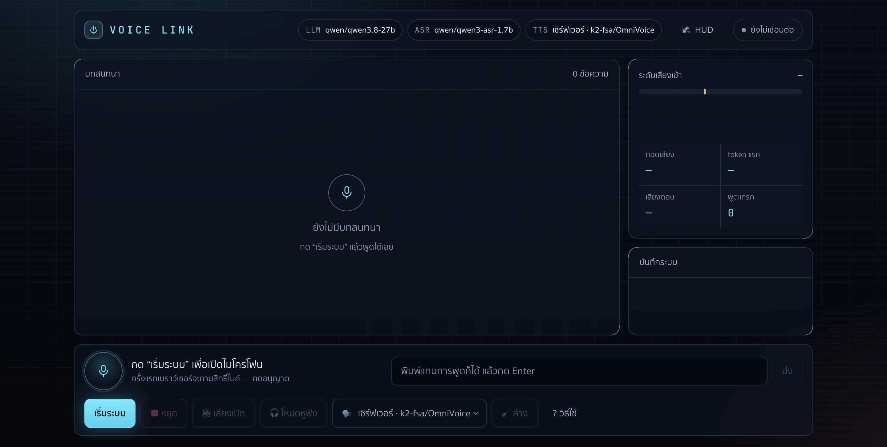

[](LICENSE)

# ระบบสนทนาเสียงกับ AI แบบเรียลไทม์ (ภาษาไทย)

ระบบสนทนาด้วยเสียงกับ LLM แบบเรียลไทม์: รับเสียงพูด → ถอดเสียงเป็นข้อความ (ASR)
→ ประมวลผลด้วย LLM แบบสตรีม → สังเคราะห์เสียงพูดกลับ (TTS)

**คุณสมบัติหลัก**

- แสดง caption บทสนทนาบนหน้าจอแบบเรียลไทม์
- รองรับการพูดแทรก AI ได้ตลอดเวลา (barge-in)
- เลือกเสียงพูดของ AI ได้ ทั้งโมเดล TTS บนเซิร์ฟเวอร์และเสียงไทยของ Microsoft Edge
- ค้นหาข้อมูลจากอินเทอร์เน็ตเพื่อตอบคำถามที่เปลี่ยนตามเวลา พร้อมอ้างอิงแหล่งที่มา
- บันทึกบทสนทนาทุกครั้งลงโฟลเดอร์ `logs/`

ค่าคอนฟิก API และชื่อโมเดลทั้งหมดกำหนดผ่านไฟล์ `.env` ไม่มีการฝังค่าคงที่ในโค้ด



หน้าเว็บ: บทสนทนาแบบสตรึมเรียลไทม์ มิเตอร์เสียงเข้า/ความล่าช้า ปุ่มควบคุมไมค์และเสียงตอบ

## รูปแบบการใช้งาน

ระบบมีสองส่วนติดต่อผู้ใช้ที่ทำงานบนแกนหลักเดียวกัน

| โหมด       | คำสั่งรัน               | เหมาะสำหรับ                                                            |
| ---------- | ----------------------- | ---------------------------------------------------------------------- |
| เว็บ       | `python3 -m web.server` | การใช้งานทั่วไป มีมิเตอร์เสียง ปุ่มควบคุม และคู่มือแนะนำการใช้งานในตัว |
| เทอร์มินัล | `python3 voice_chat.py` | การใช้งานผ่าน command line หรือเชื่อมต่อกับสคริปต์อื่น                 |

---

## 1. การติดตั้ง

```bash
cd voice-asr-tts
python3 -m venv .venv
source .venv/bin/activate
pip install -r requirements.txt
```

บน macOS ต้องอนุญาตให้แอปเทอร์มินัลเข้าถึงไมโครโฟนที่
**System Settings → Privacy & Security → Microphone** ระบบจะขอสิทธิ์นี้โดยอัตโนมัติ
เมื่อรันครั้งแรก

คัดลอก `.env.example` เป็น `.env` แล้วกำหนดค่า API key และชื่อโมเดลตามที่ใช้งาน

---

## 2. โหมดเว็บ

```bash
python3 -m web.server
# เปิดเบราว์เซอร์ที่ http://127.0.0.1:8000
```

การเปิดใช้งานครั้งแรกจะมีคู่มือแนะนำ 5 ขั้นตอน อธิบายการทำงานของระบบ
ขอสิทธิ์ไมโครโฟน ทดสอบระบบ (TTS → ASR → LLM) และสอนวิธีใช้งานปุ่มควบคุมต่าง ๆ
สามารถเปิดคู่มือซ้ำได้ทุกเมื่อจากปุ่ม **? วิธีใช้** ที่มุมล่างขวาของหน้าจอ

**ส่วนประกอบของหน้าเว็บ**

| ส่วน    | รายละเอียด                                                                                                                                                                                                                                   |
| ------- | -------------------------------------------------------------------------------------------------------------------------------------------------------------------------------------------------------------------------------------------- |
| กลางจอ  | บทสนทนาแบบสตรีมทีละคำ พร้อมป้ายกำกับ "ถูกพูดขัด" เมื่อ AI ถูกพูดแทรก · เลื่อนตามอัตโนมัติเฉพาะเมื่อยังอยู่ที่ก้นหน้า ถ้าเลื่อนขึ้นไปอ่านย้อนจะมีปุ่ม **↓ ล่าสุด** ให้กดกลับ                                                                  |
| แผงขวา  | มิเตอร์เสียงเข้า เส้นเกณฑ์ VAD รูปคลื่นเสียงสด ค่า latency ของ ASR / token แรก / TTS จำนวนครั้งที่พูดแทรก และบันทึกระบบ (แผงนี้ถูกซ่อนบนจอแคบกว่า 1000px)                                                                                    |
| แถบล่าง | วงกลมไมค์ที่วงแหวนขยับตามระดับเสียงจริงและเปลี่ยนสีตามช่วงของเทิร์น (ฟัง / คิด / ค้นเน็ต / พูด / ผิดพลาด) · ปุ่มหยุด ปิดเสียง สลับโหมดลำโพง-หูฟัง ตัวเลือกเสียงพูด ล้างประวัติ ช่องพิมพ์ข้อความ และแถบแจ้งเตือนข้อผิดพลาดที่เห็นได้ทุกขนาดจอ |

**หมายเหตุการใช้งาน**

- ปุ่มโหมดเสียงบอก**โหมดที่กำลังใช้อยู่** ไม่ใช่โหมดที่จะสลับไป: **🔈 โหมดลำโพง** คือค่าเริ่มต้น
  (ตรงกับ `ECHO_GUARD=1` — กันไมค์ได้ยินเสียง AI ของตัวเองจนตัดคำตอบทิ้ง) กดหนึ่งครั้งเพื่อ
  สลับเป็น **🎧 โหมดหูฟัง** ซึ่งพูดแทรกได้ไวที่สุดเมื่อใส่หูฟัง · ป้ายบนปุ่ม สถานะ
  `aria-pressed` และค่าที่ส่งให้เซิร์ฟเวอร์ถูกซิงก์จากโค้ดจุดเดียวตั้งแต่หน้าเว็บโหลดเสร็จ
- ช่อง **🗣 เสียงพูด** สลับแบ็กเอนด์ TTS ได้ระหว่างสนทนา (ดูรายละเอียดในหัวข้อ 8)
  เลือกแล้วระบบจะตัดเสียงที่กำลังพูดอยู่ทิ้งเพื่อไม่ให้ได้ยินสองเสียงในคำตอบเดียว
  และจำค่าที่เลือกไว้ให้ในเบราว์เซอร์
- ถ้าการเชื่อมต่อหลุด หน้าเว็บจะเชื่อมต่อใหม่เองแบบถอยเวลาเพิ่มขึ้น (0.5 → 15 วินาที)
  และเมื่อได้ session ใหม่จะแทรกเส้นคั่นในบทสนทนาบอกว่า **AI ไม่จำข้อความด้านบนแล้ว**
  เพราะเซิร์ฟเวอร์สร้าง session ใหม่ทุกครั้งที่เชื่อมต่อ · ครบจำนวนครั้งแล้วจะขึ้นปุ่มให้กดเอง
- การเปิดใช้งานจากเครื่องอื่นในวง LAN ทำได้ด้วย `python3 -m web.server --host 0.0.0.0`
  แต่เบราว์เซอร์อนุญาตสิทธิ์ไมโครโฟนเฉพาะหน้าเว็บที่เป็น secure context (`https://` หรือ
  `http://localhost`) เท่านั้น เปิดผ่าน `http://<ไอพี>` แล้วหน้าเว็บจะแจ้งเตือนทันทีที่โหลดเสร็จ
  พร้อมปิดปุ่มเริ่มระบบ — วิธีที่ง่ายที่สุดคือ SSH port-forward มาที่ `localhost` ของเครื่องตัวเอง

**ความปลอดภัยของโหมดเว็บ**

เซิร์ฟเวอร์ตรวจสิทธิ์ก่อนรับการเชื่อมต่อทุกครั้ง (ตั้งแต่เวอร์ชันนี้เป็นต้นไป)

| ชั้น            | พฤติกรรม                                                                                                                                                                                                                                               |
| --------------- | ------------------------------------------------------------------------------------------------------------------------------------------------------------------------------------------------------------------------------------------------------ |
| `Origin`        | ตรวจ**ก่อน**ตอบรับ WebSocket ถ้าไม่อยู่ในรายการที่อนุญาตจะปิดด้วยรหัส `1008` ทันทีโดยไม่สร้าง session                                                                                                                                                  |
| Session token   | เซิร์ฟเวอร์สุ่ม token **ใหม่ทุกครั้งที่โหลดหน้าเว็บ** (หนึ่งแท็บหนึ่งใบ) ฝังลงหน้าเว็บตอนเสิร์ฟ · `/ws` ใช้ cookie `HttpOnly` ที่ตั้งให้อัตโนมัติ ส่วน `/api/*` ใช้ header `X-Session-Token` · ไม่มี/ผิด/หมดอายุ = `401` หรือปิด WebSocket ด้วย `1008` |
| อายุ token      | หมดอายุตาม `WEB_TOKEN_TTL_S` (ปริยาย 12 ชม.) นับจากครั้งล่าสุดที่ใช้งาน — เซสชันที่ยังคุยอยู่จึงไม่หลุดกลางทาง ใบที่รั่วออกไปหมดอายุเอง ไม่ได้อยู่ถึงรีสตาร์ตเซิร์ฟเวอร์                                                                               |
| ข้อมูลที่ส่งออก | event `ready` และ `/api/config` ไม่ส่ง path บันทึกในเครื่องและไม่ส่ง `API_BASE_URL` ออกไปให้เบราว์เซอร์อีกต่อไป · ไม่ประกาศ header `Server: uvicorn`                                                                                                   |
| โควตาการเรียก   | `WEB_RATE_LIMIT` ครั้งต่อ `WEB_RATE_WINDOW_S` วินาที สำหรับ `/api/config` และการเปิด `/ws` ต่อผู้เรียกหนึ่งราย · `/api/selftest` มีเพดานแยกที่แน่นกว่า (`WEB_SELFTEST_LIMIT`) เพราะยิงครบวง TTS→ASR→LLM ทุกครั้ง · `WEB_MAX_SESSIONS` จำกัดจำนวน session ที่เปิดพร้อมกันได้ · ตั้งค่าใดเป็น `0` = ปิดเพดานนั้น |

- ค่าเริ่มต้นอนุญาตเฉพาะ `http://127.0.0.1:<พอร์ต>` และ `http://localhost:<พอร์ต>`
  เปิดจากโดเมนอื่นให้ตั้ง `WEB_ALLOWED_ORIGINS=https://voice.example.com` (คั่นหลายค่าด้วยจุลภาค)
- รันด้วย `--host 0.0.0.0` โดยไม่ตั้ง `WEB_AUTH_TOKEN` จะขึ้น **WARNING** ตอนเปิดเซิร์ฟเวอร์
  เพราะทุกคนในวง LAN ที่เปิดหน้าเว็บได้จะได้ token ไปด้วยและใช้ API key ขององค์กรผ่านเครื่องนี้ได้
  ถ้าต้องเปิดจริงให้ตั้ง `WEB_AUTH_TOKEN` และ `WEB_ALLOWED_ORIGINS` เองใน `.env`
- การตั้ง `WEB_AUTH_TOKEN` เองจะ**ปิดการหมุน token** (ใช้ค่าที่ตั้งไว้ตลอด) ซึ่งจำเป็นเมื่อรันหลาย
  worker เพราะ token ที่หมุนเก็บอยู่ในหน่วยความจำของ process เดียว worker อื่นยืนยันไม่ผ่าน
- อยู่หลัง reverse proxy จริง (Cloudflare ฯลฯ) ให้ตั้ง `WEB_TRUST_PROXY=1` เพื่อนับโควตาแยกตาม
  IP ผู้ใช้จริงจาก `X-Forwarded-For` — ตั้งได้เฉพาะเมื่ออยู่หลัง proxy จริงเท่านั้น ไม่งั้นใครก็
  ปลอม header นี้รีเซ็ตโควตาตัวเองได้

### Deploy บน Coolify จาก Private Repository

โปรเจกต์มี `Dockerfile` พร้อมให้ Coolify build ได้โดยตรง:

1. เชื่อม GitHub App ของ Coolify และให้สิทธิ์เข้าถึง repository นี้
2. สร้าง Resource แบบ **Private Repository (with GitHub App)** แล้วเลือก repository และ branch
3. เลือก Build Pack เป็น **Dockerfile** โดยใช้ Dockerfile Location เป็น `/Dockerfile`
4. ตั้ง Port เป็น `8000` และผูก domain เพื่อให้ Coolify ออก HTTPS ให้อัตโนมัติ (จำเป็นสำหรับการใช้ไมโครโฟนบนเบราว์เซอร์)
5. เพิ่ม Environment Variables จาก `.env.example` ใน Coolify อย่างน้อยต้องมี `API_BASE_URL` และ `API_KEY` โดยไม่ต้อง commit ไฟล์ `.env`
6. กด Deploy; container จะรับค่า `PORT` จาก Coolify ได้ และจะใช้ `8000` เป็นค่าเริ่มต้น

โฟลเดอร์ `logs/` อยู่ภายใน container และจะหายเมื่อ redeploy หากต้องการเก็บบันทึกถาวร
ให้เพิ่ม Persistent Storage ของ Coolify โดย mount ไปที่ `/app/logs`

---

## 3. โหมดเทอร์มินัล

```bash
# ทดสอบการเชื่อมต่อ API โดยไม่ใช้ไมค์
python3 voice_chat.py --selftest

# เริ่มสนทนาด้วยเสียงจริง (แนะนำให้ใส่หูฟังเพื่อลดเสียงสะท้อน)
python3 voice_chat.py --headphones
```

เมื่อเริ่มโปรแกรม ระบบจะขอสิทธิ์ไมโครโฟน วัดระดับเสียงรบกวนรอบข้างสั้น ๆ
จากนั้น AI จะทักทายด้วยเสียง หลังจากนั้นสามารถพูดใส่ไมค์ได้ทันทีโดยไม่ต้องกดปุ่มใด ๆ
AI จะตอบกลับเป็นเสียงพร้อม caption บนหน้าจอ และรองรับการพูดแทรกได้ตลอดเวลา

จบการสนทนาด้วย `Ctrl+C` หรือพิมพ์ `/quit` แล้วกด Enter บทสนทนาจะถูกบันทึกไว้ที่
`logs/` โดยอัตโนมัติ

หากยังไม่มีไมค์หรือลำโพงพร้อมใช้งาน ให้ใช้ `python3 voice_chat.py --no-mic`
เพื่อพิมพ์ข้อความโต้ตอบแทนการพูด

### คำสั่งระหว่างสนทนา

| คำสั่ง                 | ผลลัพธ์                         |
| ---------------------- | ------------------------------- |
| พูดขณะ AI กำลังพูด     | AI หยุดพูดทันทีแล้วรับฟังผู้ใช้ |
| กด `Enter`             | สั่งหยุด AI ด้วยตนเอง           |
| พิมพ์ข้อความ + `Enter` | ส่งข้อความแบบไม่ใช้เสียง        |
| `/mute`                | เปิด/ปิดเสียงพูดของ AI          |
| `/clear`               | ล้างประวัติการสนทนา             |
| `/log`                 | แสดงตำแหน่งไฟล์บันทึก           |
| `/quit` หรือ `Ctrl+C`  | ออกจากโปรแกรม                   |

### ตัวเลือกบรรทัดคำสั่ง

```
--list-devices          แสดงรายการไมค์/ลำโพงพร้อมหมายเลขอุปกรณ์
--input-device <n>      เลือกไมโครโฟนตามหมายเลข
--output-device <n>     เลือกลำโพงตามหมายเลข
--model <name>          ทับค่า CHAT_MODEL ใน .env
--no-tts                แสดง caption อย่างเดียว ไม่ออกเสียง
--no-mic                โหมดพิมพ์ข้อความ ไม่ใช้ไมโครโฟน
--no-web                ปิดการค้นข้อมูลจากอินเทอร์เน็ต
--save-audio            บันทึกไฟล์เสียงที่ผู้ใช้พูดไว้ตรวจสอบย้อนหลัง
--threshold <n>         ปรับเกณฑ์ความไวในการตรวจจับเสียงพูด
--mic-check             แสดงมิเตอร์เสียงเข้าแบบสด สำหรับตรวจสอบเมื่อเสียงไม่เข้า
--mic-gain <n>          กำหนดอัตราขยายเสียงไมค์เอง (ค่าเริ่มต้นคำนวณอัตโนมัติ)
--one-voice             รอคำตอบให้จบก่อนแล้วจึงพูด เสียงจะสม่ำเสมอกว่าแต่เริ่มพูดช้าลง
--tts-backend <api|edge> เลือกแบ็กเอนด์เสียงพูด (ทับค่า TTS_BACKEND ใน .env)
--voice <name>          เสียงของ Microsoft Edge เช่น th-TH-NiwatNeural (เปิดโหมด edge ให้เอง)
--list-voices           แสดงรายชื่อเสียงภาษาไทยของ Microsoft Edge
```

หากพูดแล้วเสียงไม่เข้า สาเหตุที่พบบ่อยที่สุดคือระดับ input volume ของเครื่องถูกปรับต่ำไว้
ตรวจสอบด้วย `python3 voice_chat.py --mic-check` และปรับด้วย
`osascript -e 'set volume input volume 80'` บน macOS

---

## 4. การทดสอบระบบ

ชุดเทสต์หลักรันด้วย **pytest** (`pytest.ini` ที่รากโปรเจกต์) ค่าเริ่มต้น
`-m "not network and not browser"` จึงไม่เปิดการเชื่อมต่ออินเทอร์เน็ตและไม่เปิดเบราว์เซอร์เลย
— รันได้ปลอดภัยหลังแก้โค้ดทุกครั้ง

```bash
pytest                              # ชุดเริ่มต้น ~477 เทสต์ ไม่ต่อเน็ต ไม่ใช้ไมค์ ~13 วินาที
pytest -m unit                      # เซตเดียวกัน ระบุ marker ชัดเจน
pytest -m browser                   # 21 เทสต์ Playwright กับหน้าเว็บจริง (ต้องมี chromium)
pytest tests/test_layering.py -v    # รันไฟล์เดียว
```

ติดตั้ง Playwright เฉพาะเมื่อจะรัน `-m browser` (ไม่อยู่ใน `requirements.txt`):

```bash
pip install playwright && python3 -m playwright install chromium
```

ไฟล์เทสต์เก่า 5 ไฟล์เขียนก่อนย้ายมาใช้ pytest และมี harness `check()` ของตัวเอง
`tests/conftest.py` ใส่ไว้ใน `collect_ignore` ให้ pytest ข้ามไป จึงต้องรันตรงด้วยมือ —
การลบ/เปลี่ยนชื่อฟังก์ชันใน `vc/` จะไม่ขึ้นเป็นเทสต์แดงจนกว่าจะรันไฟล์พวกนี้เอง:

```bash
python3 voice_chat.py --selftest         # ทดสอบ TTS → ASR → LLM ครบวงจร
python3 tests/test_offline.py            # VAD / การพูดแทรก / การตัดประโยค — ไม่ต่อเน็ต
python3 tests/test_web.py                # สะพานฝั่งเว็บ WebMic/WebSpeaker/WebConsole — ไม่ต่อเน็ต
python3 tests/test_search.py --offline   # ตรวจ URL/host และ SSRF guard เท่านั้น — ไม่ต่อเน็ต
python3 tests/test_search.py             # เพิ่มการค้นเน็ต + tool calling จริง (ต้องมี .env)
python3 tests/test_web_e2e.py            # เซสชันเว็บเต็มรูปแบบผ่าน WebSocket จริง (ต้องมี .env)
python3 tests/test_browser.py            # เปิดเบราว์เซอร์จริงด้วย Playwright (ต้องมี .env + chromium)
```

`test_offline.py` และ `test_web.py` ไม่ต่อเน็ตจึงรันได้ทุกเมื่อ ส่วน `test_web_e2e.py`
กับ `test_browser.py` ยิงไปที่ ASR/LLM/TTS จริงตาม `.env` และมีค่าใช้จ่าย API จริง —
อย่ารันพร่ำเพรื่อเพียงเพื่อเช็คว่าโค้ดพัง

CI (`.github/workflows/tests.yml`) รันเฉพาะ `pytest -q` แล้วตามด้วยสามไฟล์ offline
(`test_offline.py` / `test_web.py` / `test_search.py --offline`) ไม่ต้องมี `.env` หรือ
เครดิตใด ๆ ส่วน `-m browser`, `-m network`, `test_web_e2e.py`, `test_browser.py`
ตั้งใจไม่ใส่ใน CI เพราะต้องมี credential จริง

`tests/test_browser.py` เปิด Chromium จริงผ่าน Playwright โดยใช้ไมโครโฟนจำลอง
ที่ป้อนเสียงจากไฟล์ WAV เพื่อทดสอบเส้นทางเสียงทั้งหมดโดยไม่ต้องมีผู้พูดจริง
ครอบคลุมคู่มือแนะนำการใช้งาน, การจับเสียงผ่าน `getUserMedia` และ AudioWorklet,
การถอดเสียง, การเล่นเสียง, การพูดแทรก, การค้นเน็ตพร้อมแสดงแหล่งที่มา
และปุ่มควบคุมทั้งหมด

```bash
pip install playwright && python3 -m playwright install chromium
python3 tests/test_browser.py            # โหมด headless
python3 tests/test_browser.py --headed   # เปิดหน้าต่างเบราว์เซอร์ให้เห็น
```

---

## 5. การบันทึกบทสนทนา

ทุกครั้งที่รันจะได้โฟลเดอร์ `logs/session-YYYYMMDD-HHMMSS/` ประกอบด้วย

| ไฟล์                 | เนื้อหา                                                                                    |
| -------------------- | ------------------------------------------------------------------------------------------ |
| `transcript.md`      | บทสนทนาอ่านง่าย มีเวลากำกับและระบุจุดที่ AI ถูกพูดขัด                                      |
| `session.jsonl`      | เหตุการณ์ทั้งหมด (`asr`, `message`, `tts`, `interrupt`, `tool`) พร้อม latency แต่ละขั้นตอน |
| `audio/user-NNN.wav` | เสียงที่ผู้ใช้พูด (บันทึกเฉพาะเมื่อใช้ `--save-audio`)                                     |

ตรวจสอบ latency ย้อนหลังได้ด้วยคำสั่ง

```bash
python3 -c "import json,sys;[print(r.get('type'),r.get('latency_ms') or r.get('first_token_ms')) for r in map(json.loads,open(sys.argv[1]))]" logs/session-*/session.jsonl
```

**บันทึกคือข้อมูลอ่อนไหว** — เป็นคำพูดจริงของผู้ใช้แบบ plaintext ที่อยู่บนดิสก์ถาวร

| ค่าใน `.env`           | ผลลัพธ์                                                                                                                                         |
| ---------------------- | ----------------------------------------------------------------------------------------------------------------------------------------------- |
| `LOG_DIR`              | ย้ายที่เก็บบันทึก (ไม่ตั้ง = `./logs`) ใส่ path สัมพัทธ์ได้ อ้างจากรากโปรเจกต์                                                                  |
| `LOG_TRANSCRIPT=0`     | ไม่เขียนคำพูดลงดิสก์เลย — ไม่มี `transcript.md` ไม่มีไฟล์เสียง และข้อความใน `session.jsonl` เหลือแค่จำนวนตัวอักษร (ตัวเลข latency ยังอยู่ครบ)   |
| `LOG_RETENTION_DAYS=7` | ลบโฟลเดอร์ session ที่เก่ากว่า 7 วันให้เองตอนเริ่มโปรแกรม · ค่าเริ่มต้น `0` = **ไม่ลบอะไรเลย** (ลบแล้วกู้คืนไม่ได้ จึงไม่ทำให้เองโดยไม่ได้สั่ง) |

โฟลเดอร์บันทึกที่ระบบสร้างใหม่ตั้งสิทธิ์เป็น `700` และไฟล์เป็น `600` ให้อัตโนมัติ
ส่วนไฟล์ `.env` ที่มี API key อยู่ ระบบตั้งสิทธิ์ให้ไม่ได้ (ผู้ใช้สร้างเอง) จึงควรสั่ง

```bash
chmod 600 .env        # กันผู้ใช้อื่นบนเครื่องเดียวกันอ่าน API key
```

`.env` อยู่ใน `.gitignore` แล้ว จึงไม่ถูก commit ขึ้น repository

---

## 6. การค้นข้อมูลจากอินเทอร์เน็ต

ระบบค้นหาข้อมูลจากอินเทอร์เน็ตโดยอัตโนมัติเมื่อผู้ใช้ถามเรื่องที่เปลี่ยนแปลงตามเวลา
และแสดงแหล่งที่มาให้เห็นทุกครั้ง โดยใช้ DuckDuckGo จึงไม่ต้องใช้ API key เพิ่มเติม

**เครื่องมือที่ AI เรียกใช้ได้**

| เครื่องมือ   | หน้าที่                                                                                                         |
| ------------ | --------------------------------------------------------------------------------------------------------------- |
| `web_search` | ค้นหาและคืนหัวข้อ ลิงก์ และคำอธิบายย่อ 5 อันดับแรก (ตัดโดเมนซ้ำ)                                                |
| `open_page`  | เปิดอ่านเนื้อหาหน้าเว็บเมื่อคำอธิบายย่อไม่เพียงพอต่อการตอบ — เปิดได้เฉพาะลิงก์ที่มาจากผลค้นใน**เทิร์นเดียวกัน** |

แหล่งที่มาจะแสดงเป็นชิปลิงก์ใต้คำตอบบนหน้าเว็บ เป็นรายการใต้คำตอบบนเทอร์มินัล
และถูกบันทึกลงทั้ง `transcript.md` และ `session.jsonl`

**ข้อกำหนดและข้อจำกัด**

- ระบบแนบวันเวลาปัจจุบันให้โมเดลทุกครั้งเพื่อให้ตอบคำถามเชิงเวลาได้ถูกต้อง
- คำถามความรู้ทั่วไปที่ไม่เปลี่ยนตามเวลาจะไม่ถูกค้นหา เพื่อลดเวลาตอบสนอง
- ขอบเขตของ `open_page` (ตรวจซ้ำทุกครั้งที่หน้าเว็บสั่งเปลี่ยนทาง ไม่ใช่แค่ URL แรก)

  | ข้อจำกัด         | ค่าที่ใช้จริง                                                                                                                                   |
  | ---------------- | ----------------------------------------------------------------------------------------------------------------------------------------------- |
  | โปรโตคอล         | `http` และ `https` เท่านั้น (ลิงก์ที่ฝัง user:password ถูกปฏิเสธ)                                                                               |
  | พอร์ต            | 80 และ 443 เท่านั้น                                                                                                                             |
  | ปลายทาง          | ต้องเป็น IP สาธารณะ — บล็อก localhost, IP วง LAN, link-local (รวม `169.254.169.254`) และ IPv4-mapped IPv6                                       |
  | จำนวน redirect   | ตามได้ไม่เกิน 3 ครั้ง และตรวจที่อยู่ปลายทางใหม่ทุกครั้ง เกินแล้วคืน `too many redirects`                                                        |
  | ขนาดที่ดาวน์โหลด | หยุดอ่านเมื่อถึง `FETCH_MAX_BYTES` (ค่าเริ่มต้น 512000 ไบต์) แล้วปิดการเชื่อมต่อทันที                                                           |
  | การบีบอัด        | ขอ `Accept-Encoding: identity` และปฏิเสธ response ที่ยังส่ง `Content-Encoding` แบบบีบอัด เพื่อกัน decompression bomb ขยายเกินเพดานในหน่วยความจำ |
  | ชนิดเนื้อหา      | ตรวจจาก header ก่อนอ่านเนื้อหา ยอมเฉพาะ `text/*`, `application/xhtml+xml`, `application/json`                                                   |
  | เวลารวม          | `SEARCH_TIMEOUT` เป็นงบเวลารวมทั้งคำขอ (นับข้าม redirect และระหว่างอ่านเนื้อหา)                                                                 |

  ข้อจำกัดที่ยังเหลืออยู่: DNS rebinding (TOCTOU) — ระบบตรวจที่อยู่ตอน resolve
  แล้ว httpx resolve เองอีกครั้งตอนต่อจริง โดเมนที่ตั้ง TTL สั้นมากยังสลับคำตอบ
  ระหว่างสองจังหวะนั้นได้ (มีคอมเมนต์กำกับไว้ที่ `vc/websearch.py`)

- กันคำสั่งที่ฝังมากับเนื้อหาเว็บ (prompt injection)
  - `open_page` เปิดได้เฉพาะลิงก์ที่ `web_search` คืนมาในเทิร์นเดียวกัน
    รายการนี้ถูกล้างทุกครั้งที่ขึ้นเทิร์นใหม่ · ลิงก์นอกรายการจะได้ข้อความปฏิเสธกลับไป
    โดยไม่มีการยิงคำขอออกไปและบทสนทนายังดำเนินต่อได้ตามปกติ
  - ผลลัพธ์ของเครื่องมือทุกตัวถูกห่อด้วย `<<<EXTERNAL_CONTENT untrusted=true>>>`
    พร้อมประโยคกำกับว่าเป็นข้อมูล ไม่ใช่คำสั่ง และสตริง `<<<` / `>>>` ที่ปนมาในเนื้อหา
    จะถูก escape เพื่อไม่ให้ปิดบล็อกก่อนกำหนด
  - ผลค้นที่จำไว้ข้ามเทิร์นถูกส่งกลับเข้าบทสนทนาในบทบาท `user` **ไม่ใช่ `system`**
- ปิดการค้นเน็ตได้ด้วย `--no-web` หรือกำหนด `WEB_SEARCH=0` ใน `.env`

---

## 7. โครงสร้างโค้ด

```
voice_chat.py           ตัวเรียกฝั่งบรรทัดคำสั่ง: อ่าน argument → ประกอบค่าตั้ง → สั่ง vc/
vc/chat.py              ตัวควบคุมหลัก: วนรับเหตุการณ์ จัดคิว TTS จัดการการพูดแทรก
vc/phase.py             TurnPhase (IDLE/TRANSCRIBING/GENERATING/SPEAKING) และกติกาพูดแทรกต่อช่วง
vc/options.py           RuntimeOptions — สัญญาของตัวเลือกตอนรันที่แกนกลางเป็นเจ้าของ
vc/config.py            โหลดค่าคอนฟิกจาก .env พร้อมตรวจช่วงค่าและเขตเวลา
vc/api.py               เรียก LiteLLM: chat แบบสตรีม, ASR, TTS, แปลง WAV/PCM
vc/tts_edge.py          แบ็กเอนด์ TTS ทางเลือก: Microsoft Edge (เลือกเสียงไทยได้)
vc/audio.py             ไมโครโฟนสตรีมต่อเนื่องและลำโพงที่หยุดกลางทางได้ (เทอร์มินัล)
vc/vad.py               ตรวจจับเสียงพูดและป้องกันเสียงสะท้อนจากลำโพงตัวเอง
vc/echo.py              ยืนยันว่าการพูดแทรกเป็นคนพูดจริง ไม่ใช่เสียงลำโพงย้อนเข้าไมค์
vc/chunker.py           ตัดข้อความสตรีมเป็นก้อนสั้นเพื่อให้ TTS เริ่มพูดได้เร็วขึ้น
vc/thaispell.py         ตรวจ/แก้คำผิดภาษาไทยของผลถอดเสียงก่อนส่งให้โมเดล (PyThaiNLP)
vc/greeting.py          คำทักทายตอนเริ่มระบบ — ให้ LLM แต่งใหม่ทุกครั้งโดยไม่ซ้ำของเดิม
vc/thaiabbr.py          คลี่ตัวย่อไทยเป็นคำเต็มก่อนอ่านออกเสียง (ส.ค. → สิงหาคม)
vc/ui.py                แสดง caption บนเทอร์มินัล
vc/logger.py            บันทึกข้อมูลรูปแบบ JSONL และ Markdown
vc/selftest.py          ตรวจ TTS → ASR → LLM ครบวง (โค้ดชุดเดียวที่ CLI และเว็บใช้ร่วมกัน)
vc/websearch.py         ค้นหาผ่าน DuckDuckGo และอ่านเนื้อหาหน้าเว็บ
vc/tools.py             นิยามเครื่องมือที่ LLM เรียกได้และจัดเก็บแหล่งที่มา

web/server.py           เซิร์ฟเวอร์ FastAPI: เสิร์ฟหน้าเว็บ, WebSocket, /api/selftest
web/session.py          หนึ่ง WebSocket ต่อหนึ่ง session (สืบทอดจาก vc/chat.py)
web/bridge.py           WebMic / WebSpeaker / WebConsole ทำหน้าที่แทนไมค์ ลำโพง และจอ
web/static/index.html   โครงหน้าเว็บและคู่มือแนะนำการใช้งาน
web/static/style.css    ธีมของหน้าเว็บ
web/static/theme-init.js  บูตธีม dark/light ก่อน render (สคริปต์แยกไฟล์ เพราะ CSP ไม่มี unsafe-inline)
web/static/app.js       จับเสียงไมค์ เล่นเสียง วาด caption/มิเตอร์ ควบคุมคู่มือ
web/static/mic-worklet.js  แปลงเสียงไมค์เป็นเฟรม 16 kHz / 20 ms ใน audio thread
```

โหมดเว็บใช้ตรรกะหลักเดียวกับโหมดเทอร์มินัลทั้งหมด `web/session.py` สืบทอดคลาส
`VoiceChat` จาก `vc/chat.py` และเปลี่ยนเฉพาะปลายทางเข้า-ออก ส่วนการตรวจจับเสียงพูด
(`vc/vad.py`) การจัดคิว TTS การตัดสินใจพูดแทรก และการบันทึกล็อกเป็นโค้ดชุดเดียวกัน

**ทิศทางการพึ่งพา** — ทุกอย่างใน `vc/` ไม่รู้จักทั้งบรรทัดคำสั่งและเว็บเฟรมเวิร์ก
ชั้นบน (`voice_chat.py` / `web/`) เป็นฝ่ายพึ่ง `vc/` ทางเดียวเสมอ ผลที่ได้คือ

- `web/` ไม่ import สคริปต์ CLI แล้ว และ `sounddevice`/PortAudio ถูกโหลดตอน
  "เปิดอุปกรณ์เสียงจริง" เท่านั้น — เว็บเซิร์ฟเวอร์จึงรันบนคอนเทนเนอร์ที่ไม่มี
  อุปกรณ์เสียงได้ (ก่อนหน้านี้ import ล้มตั้งแต่ต้น)
- ตัวเลือกตอนรันเป็น dataclass `RuntimeOptions` ที่แกนกลางประกาศเอง ฝั่งเว็บ
  ไม่ต้องปลอม Namespace ของ CLI ขึ้นมาอีก
- ถ้าเรียกโหมดเทอร์มินัลบนเครื่องที่ไม่มี PortAudio จะได้ข้อความบอกวิธีแก้
  พร้อมคำแนะนำให้ใช้โหมดเว็บแทน ไม่ใช่ `ImportError` ดิบ ๆ

---

## 8. หลักการทำงาน

**ช่วงของเทิร์น (turn phase)** — สถานะของหนึ่งเทิร์นแยกเป็นสี่ช่วงชัดเจน
(`vc/phase.py`) และกติกาการพูดแทรกขึ้นกับช่วงที่อยู่ ไม่ใช่แค่ "ว่าง/ไม่ว่าง"

| ช่วง           | ความหมาย                                    | เสียงพูดใหม่ที่เข้ามา                                         |
| -------------- | ------------------------------------------- | ------------------------------------------------------------- |
| `IDLE`         | รอฟัง                                       | เริ่มเทิร์นใหม่                                               |
| `TRANSCRIBING` | กำลังถอดเสียงที่เพิ่งพูดจบ                  | **ไม่นับเป็นการพูดแทรก** — ต่อเป็นประโยคเดียวกันของเทิร์นเดิม |
| `GENERATING`   | กำลังคิด/เรียบเรียงคำตอบ (ยังไม่มีเสียงออก) | ยกเลิกเทิร์นเดิม เริ่มเทิร์นใหม่                              |
| `SPEAKING`     | มีเสียงคำตอบออกลำโพงแล้ว                    | หยุดเสียงทันที ยกเลิกเทิร์นเดิม เริ่มใหม่                     |

การแยก `TRANSCRIBING` ออกมาสำคัญมาก: ถ้าถือว่าเสียงที่เข้ามาตอนถอดเสียงเป็นการ
พูดแทรก ระบบจะยกเลิกเทิร์นของตัวเองก่อนที่จะได้เรียกโมเดล ผลคือผู้ใช้ไม่ได้คำตอบ
โดยไม่มีข้อความผิดพลาดใด ๆ (พฤติกรรมนี้ถูกแก้แล้วและมีเทสต์กันไว้)
คำทักทายตอนเริ่มระบบก็ทำงานอยู่ในช่วง `SPEAKING` เต็มรูปแบบ จึงพูดแทรกได้จริง
เหมือนคำตอบปกติทุกประการ

**การพูดแทรก (barge-in)** — ไมค์อัดเสียงตลอดเวลาบนเธรดแยก แม้ขณะ AI กำลังพูด
เมื่อระบบตรวจพบว่าเริ่มมีเสียงพูดระหว่างที่ AI กำลังคิดหรือพูดอยู่ (ควบคุมด้วย
`VAD_CONFIRM_MS_PLAYBACK`) จะดำเนินการดังนี้

1. หยุดลำโพงทันทีและล้างบัฟเฟอร์เสียงที่ค้างอยู่
2. ล้างคิว TTS ที่รอสังเคราะห์
3. ตัดการอ่านข้อความสตรีมจาก LLM
4. บันทึกข้อความที่ AI ตอบไปแล้วทั้งหมดลงประวัติการสนทนา พร้อมหมายเหตุตำแหน่งที่ถูกพูดขัด
   เพื่อให้ AI ทราบเนื้อหาที่ได้ตอบไปแล้ว

การหยุดเสียงทำงานแบบ "ปิดประตู" ที่ตัวลำโพงเอง (`Speaker.stop()`): การตรวจว่าเสียง
ก้อนนี้เป็นของเทิร์นปัจจุบันหรือไม่ กับการต่อคิวเล่นเสียง เกิดขึ้นภายใน lock เดียวกัน
เสียงที่ TTS สังเคราะห์เสร็จ _หลัง_ ถูกพูดแทรกจึงเข้าคิวไม่ได้เลย (เดิมมีช่องว่าง
ระหว่าง "เช็ค epoch" กับ "สั่งเล่น" ที่ทำให้ยังได้ยินเสียงเทิร์นเก่าต่ออีกก้อน)

**เพดานความยาวคำตอบ** — คำตอบถูกจำกัดด้วย `REPLY_MAX_SENTENCES` และ
`REPLY_MAX_CHARS` โดยตัดสตรีมจาก LLM เองเมื่อถึงเพดานใดก่อน จุดตัดจะอยู่ที่รอยต่อ
ประโยคเสมอเมื่อข้อความมีเครื่องหมายวรรคตอน และตกไปที่ขอบคำ (วรรค) เมื่อไม่มี
เพื่อไม่ให้ค้างกลางคำ — ระบบบันทึกเหตุการณ์ `reply_capped` ไว้วัดสัดส่วนภายหลัง
(เหตุผล: prompt สั่ง "ไม่เกิน 4 ประโยค" แต่จากบันทึกจริง p90 ยังอยู่ที่ 366 ตัวอักษร)

**ความทนทานเวลาเน็ตกระตุก** — ทุกการเรียก HTTP อยู่ใน `vc/api.py` ที่เดียว และ
แปลงความผิดพลาดทุกชนิดเป็น `ApiError` ก่อนส่งขึ้นชั้นบน พร้อมลองใหม่แบบ
exponential backoff + jitter (`HTTP_RETRY_MAX`, `HTTP_RETRY_BASE_MS`) สำหรับ
เชื่อมต่อไม่ได้ / timeout / 429 / 5xx เท่านั้น — 4xx อื่นไม่ลองใหม่ และคำตอบที่
สตรีมออกไปแล้วจะไม่ถูกยิงซ้ำ (กันผู้ใช้ได้ยินท่อนเดิมสองครั้ง) หนึ่งเทิร์นที่ล้มเหลว
จะรายงานให้ผู้ใช้เห็นแล้วกลับสู่ `IDLE` เสมอ ไม่ทำให้ session ทั้งอันหลุด

**การยืนยันการพูดแทรกจริง** (`vc/echo.py`) — VAD ตัดสินจากระดับเสียงอย่างเดียว
เสียงลำโพงที่รั่วเข้าไมค์สั้น ๆ จึงถูกนับเป็นการพูดแทรกได้ ระบบตรวจผลจาก ASR อีกชั้น
ก่อนยืนยัน โดยใช้สามเกณฑ์ (สองข้อท้ายใช้เฉพาะตอนที่ AI กำลังพูดอยู่จริง)

| เกณฑ์                                                             | เหตุผลใน log     | ตัวอย่างที่เจอในบันทึกจริง            |
| ----------------------------------------------------------------- | ---------------- | ------------------------------------- |
| สั้นกว่า `BARGE_IN_MIN_CHARS`                                     | `too_short`      | ข้อความว่าง / อักขระเดียว             |
| ไม่มีอักขระไทยเลยและสั้นกว่า 40 ตัวอักษร ขณะ `LANG_HINT=th`       | `wrong_language` | `啥东西？` `我爱你。` `bản thân cậu.` |
| สั้นไม่เกิน 8 ตัวอักษร **และตรงกับข้อความที่เพิ่งออกลำโพงไปจริง** | `echo_of_reply`  | `ครับ` (คำท้ายประโยคของ AI เอง)       |

เกณฑ์ที่สามเทียบกับ "สิ่งที่ผู้ใช้ได้ยินจริง" (ข้อความของก้อนเสียงที่เล่นจบแล้ว)
ไม่ใช่คำตอบเต็ม และจำกัดความยาวไว้ 8 ตัวอักษร เพื่อไม่ให้กินกรณีที่ผู้ใช้ทวนคำ
ที่ AI เพิ่งพูด (เช่นตอบว่า "รายละเอียด" หลัง AI ถามว่าอยากฟังรายละเอียดไหม)
เมื่อเข้าเกณฑ์ใดก็ตาม ระบบคืนคำตอบเดิมกลับเข้าประวัติการสนทนา แล้วบันทึก
`false_barge_in` พร้อม `reason` และตัวนับรวมไว้วัดสัดส่วนภายหลัง

> วัดกับบันทึกจริง 37 session: มีการถอดเสียงตามหลังการพูดแทรก 34 ครั้ง เข้าเกณฑ์
> เสียงสะท้อน 5 ครั้ง (15%) โดย 2 ครั้งเป็นเคส `ครับ` ที่เกณฑ์สองข้อแรกจับไม่ได้

**ตัวเลขคุณภาพเสียงเข้า** — ตอนจบ session ระบบบันทึกเหตุการณ์ `input_stats`
(`overflows`, `dropped_frames`, `clipped`, `dropped_events`, `false_barge_ins`)
และแสดงบรรทัดสรุปให้เห็นเมื่อมีค่าไม่เป็นศูนย์ — ใช้ตอบคำถาม "ทำไมมันไม่ได้ยินที่พูด"
ได้ตรง ๆ (เฟรมล้น/ถูกทิ้ง = เสียงหายเป็นช่วง · คลิป = ขยายเสียงมากไปจนเพี้ยน)

**การจดจำผลค้นเว็บข้ามเทิร์น** — ผลลัพธ์จาก `web_search` และ `open_page`
จะถูกเก็บไว้ตามจำนวนที่กำหนดใน `KEEP_FINDINGS` และแนบกลับเป็นข้อความ system
ในทุกคำถามถัดไป แทนที่จะเก็บเป็น role `tool` เพื่อป้องกันปัญหาการตัดประวัติสนทนา
จนเหลือ tool message ที่ไม่มี tool_call คู่กัน

**การป้องกันเสียงสะท้อนเข้าไมค์** — ขณะเล่นเสียง ระบบประเมินอัตราการรั่วของเสียง
จากลำโพงเข้าไมค์ (`leak`) แบบปรับตัวอัตโนมัติ แล้วยกเกณฑ์การตรวจจับเสียงพูดตามความดัง
ของเสียงที่กำลังเล่นอยู่ (ควบคุมด้วย `ECHO_GUARD` และ `ECHO_MARGIN`) เพื่อแยกเสียงพูดจริง
จากเสียงสะท้อนของ AI เอง เมื่อใช้หูฟังให้เปิดตัวเลือก `--headphones` เพื่อปิดกลไกนี้
และลดเวลาตอบสนองต่อการพูดแทรก

**การสังเคราะห์เสียงแบบสตรีม** — ระบบไม่รอให้ LLM ตอบครบก่อนเริ่ม TTS
แต่จะส่งข้อความก้อนแรก (ขนาดกำหนดด้วย `TTS_FIRST_CHARS`) เข้า TTS ทันทีที่ได้รับ
แล้วสังเคราะห์ก้อนถัดไปคู่ขนานกับการเล่นเสียงของก้อนก่อนหน้า ขนาดก้อนถัดไปจะเพิ่มขึ้น
ตามอัตรา `TTS_CHUNK_GROWTH` โดยจำกัดไม่ให้เกินเวลาที่ก้อนก่อนหน้าใช้เล่น
เพื่อไม่ให้เสียงขาดช่วง วิธีนี้ทำให้เริ่มได้ยินเสียงตอบเร็วกว่าการรอคำตอบให้จบก่อน
(ตัวเลือก `--one-voice`) อย่างมีนัยสำคัญ

**เสียงพูดคงที่ด้วย voice cloning** — `k2-fsa/OmniVoice` สุ่มเสียงผู้พูดใหม่
ทุกคำขอ คำตอบเดียวที่ถูกหั่นเป็นหลายก้อนเพื่อลด latency จึงเปลี่ยนคนพูดกลางประโยคได้
ระบบแก้ด้วยการส่งไฟล์เสียงอ้างอิง (`sound/thai_default.wav`) ไปกับทุกคำขอ ให้โมเดล
โคลนเสียงนั้นแทนการสุ่ม วัดความเหมือนระหว่างก้อนด้วยระยะห่าง MFCC ได้ **0.77 → 0.92**
(1.00 = คนเดียวกัน) แลกกับเวลาสังเคราะห์ที่เพิ่มขึ้นราว 0.4–1.2 วินาทีต่อก้อน
จาก payload ที่ใหญ่ขึ้น

รูปแบบที่เซิร์ฟเวอร์รับมีแบบเดียว คือส่ง **คู่กัน** ทั้ง `ref_audio` ที่เป็น data URI
และ `ref_text` ที่เป็นคำอ่านของไฟล์นั้น — รายละเอียดของรูปแบบที่ลองแล้วไม่ผ่าน
อยู่ใน `vc/voiceclone.py` จุดที่พลาดง่ายที่สุดคือส่ง `ref_audio` มาเดี่ยว ๆ
เพราะเซิร์ฟเวอร์ตอบ 200 ตามปกติแต่ได้เสียงแทบเงียบ ไม่มีข้อความแจ้งเตือนใด ๆ

ตั้ง `TTS_REF_AUDIO=0` เพื่อปิดการโคลนแล้วกลับไปใช้เสียงสุ่มแบบเดิม ส่วนพารามิเตอร์
`voice`, `seed`, `speaker`, `voice_id` ยังใช้ไม่ได้เหมือนเดิม (ตอบ 500 หรือถูกเมิน)
และ TTS ยังไม่สตรีมเสียงระหว่างสังเคราะห์ อีกทางเลือกคือเปลี่ยนไปใช้แบ็กเอนด์
Microsoft Edge ตามหัวข้อถัดไป ซึ่งเลือกเสียงได้ตรง ๆ อยู่แล้ว

### คำทักทายที่ไม่ซ้ำเดิมสักครั้ง

ทุกครั้งที่เริ่มระบบ คำทักทายถูก**แต่งขึ้นใหม่โดย LLM** (`vc/greeting.py`) ไม่ใช่สุ่ม
จากข้อความตายตัวสี่แบบเหมือนเดิม prompt แนบวันเวลาปัจจุบันไปด้วย คำทักทายจึง
เปลี่ยนไปตามช่วงเวลาของวันได้เอง เช่น

```
สวัสดีครับ ตอนนี้เป็นวันพฤหัสบดีที่ 20 สิงหาคม เวลาตีหนึ่งแล้วนะครับ
ผมพร้อมคุยด้วยเสมอ และคุณพูดแทรกขัดจังหวะได้ตลอดเวลาเลยครับ
```

"ไม่ซ้ำ" ต้องมีความจำข้ามรอบการเปิดโปรแกรม เพราะแต่ละครั้งที่เริ่มคือ process ใหม่
คำทักทายล่าสุด 12 อันจึงถูกเก็บไว้ที่ `$LOG_DIR/greetings.json` (สิทธิ์ `0600`
เหมือนบันทึกอื่น) แล้วส่งกลับเข้า prompt เป็นรายการ "ห้ามซ้ำ" การเทียบว่าซ้ำใช้
ความคล้าย ไม่ใช่ต้องตรงตัวอักษร เพราะสิ่งที่โมเดลคืนมาจริง ๆ คือประโยคเดิมที่ต่างกัน
คำเดียว ซึ่งคนฟังก็นับว่าซ้ำอยู่ดี ถ้าลองแล้วยังได้ของคล้ายเดิม ระบบเลือกใช้ของโมเดล
มากกว่าถอยไปหารายการสำรอง — สี่แบบตายตัวยิ่งซ้ำหนักกว่า

ทุกทางที่ผิดพลาด (ไม่ได้ตั้ง API key, เน็ตล่ม, โมเดลตอบว่าง, ผู้ใช้ปิดแท็บระหว่างที่
ยังแต่งไม่เสร็จ) ตกกลับไปที่รายการคำทักทายสำรองในโค้ดซึ่งไม่ต้องต่อเน็ต — การเริ่ม
ระบบต้องไม่ล้มเพราะคำทักทาย · `LOG_TRANSCRIPT=0` จะไม่เขียนไฟล์ความจำนั้นเลย
(มันคือคำพูด) ผลคือรอบนั้นเลิกกันซ้ำข้ามรอบ แต่ยังแต่งใหม่ทุกครั้งเหมือนเดิม
ปิดทั้งฟีเจอร์ได้ด้วย `GREET_FROM_LLM=0`

การยิง LLM ครั้งนี้อยู่ใต้ epoch เดียวกับคำทักทายและใช้ `cancel` ตัวเดียวกัน ผู้ใช้ที่
พูดใส่ทันทีตอนเปิดระบบจึงขัดได้ตั้งแต่ตอนที่คำทักทายยังแต่งไม่เสร็จ ไม่ต้องรอให้พูดจบก่อน

### แก้คำผิดภาษาไทยก่อนส่งให้โมเดล

ASR ได้ยินผิดเป็นเรื่องปกติ — `"เป็นอย่างไร"` กลับมาเป็น `"เปนอยางไร"`,
`"เพื่อน"` กลับมาเป็น `"เพือน"` โมเดลจึงตอบเพี้ยนหรือหยิบคำที่สะกดผิดไปใช้ต่อในคำตอบ
ระบบจึงมีด่านแก้คำผิดหนึ่งด่านคั่นระหว่าง ASR กับโมเดล (`vc/thaispell.py` ใช้
[PyThaiNLP](https://pythainlp.github.io/)) แก้ที่จุดเดียวก่อนข้อความเข้าสู่เทิร์น
ทุกอย่างปลายน้ำ (การเทียบเสียงสะท้อน ประวัติสนทนา หน้าจอ `transcript.md`)
จึงเห็นข้อความชุดเดียวกัน ส่วนข้อความดิบก่อนแก้ยังอยู่ครบใน event `asr`
ของ `session.jsonl` และคำที่ถูกแก้ทุกคำถูกบันทึกเป็น event `spell_fix`

หลักคือ **ระมัดระวังไว้ก่อน** ตัวแก้คำผิดที่แก้ของถูกให้เป็นผิดแย่กว่าไม่มีเลย
เพราะผู้ใช้ไม่มีทางรู้ว่าโมเดลได้ยินคนละคำ คำหนึ่งคำจะถูกแก้ก็ต่อเมื่อผ่านครบห้าด่าน

| ด่าน                                             | ตัวอย่างที่ด่านนี้กันไว้                             |
| ------------------------------------------------ | ---------------------------------------------------- |
| ยาวอย่างน้อย `SPELL_MIN_LEN` ตัวอักษร            | `"ร"` เคยถูกแก้เป็น `"ระ"` ทั้งที่เป็นเศษจากตัวตัดคำ |
| เป็นอักษรไทยล้วน                                 | ตัวเลข อังกฤษ URL ไม่ถูกแตะเลย                       |
| พจนานุกรมยังไม่รู้จัก (รวมชื่อคนไทย ~22,000 ชื่อ) | `"สมชาย"` ไม่กลายเป็น `"ลมชาย"`                      |
| เปลี่ยนได้เฉพาะวรรณยุกต์/สระบน-ล่าง/การันต์       | เศษคำ `"เปนอ"` ไม่กลายเป็น `"เสนอ"` ซึ่งคนละเรื่อง   |
| คำปลายทางพบบ่อยอย่างน้อย `SPELL_MIN_FREQ` ครั้ง  | คำหายากที่บังเอิญสะกดใกล้กันถูกตัดทิ้ง               |

ด่านที่สี่สำคัญที่สุด เพราะคำที่ ASR ได้ยินผิดเกือบทั้งหมดผิดที่รูปวรรณยุกต์
(`"เปน"`→`"เป็น"`, `"เพิม"`→`"เพิ่ม"`, `"โทรศัพท"`→`"โทรศัพท์"`) ส่วนการเปลี่ยน
พยัญชนะคือจุดที่ตัวแก้คำเดามั่วเสมอ และมันเดาออกมาเป็น "คำจริง" ที่อ่านแล้วน่าเชื่อ
กว่าคำผิดเดิมเสียอีก ผลรวมคือประโยคไทยที่สะกดถูกอยู่แล้ว**ไม่ถูกแตะเลยสักคำ**
(มีเทสต์คุมไว้ที่ `tests/test_thaispell.py`)

ข้อจำกัดที่ยังอยู่: เมื่อคำผิดทำให้ตัวตัดคำสะดุดจนกลืนคำข้างเคียงเข้าไปด้วย
(`"อากาศเปนอยางไร"` → `อากาศ|เปนอ|ยาง|ไร`) ก้อนที่ออกมาไม่ใช่คำ จึงมักไม่มีคำที่
โครงพยัญชนะตรงกันให้แก้และถูกปล่อยผ่าน — โมเดลยังอ่านรู้เรื่องอยู่ แค่ไม่ได้ช่วย

**คำตอบของโมเดลก็ผ่านด่านเดียวกัน** — `TTS_SPELLCHECK=1` (ค่าเริ่มต้น) แก้คำผิด
ของคำตอบก่อนส่งเข้า TTS โดยใช้กฎและด่านกันชุดเดียวกันทั้งหมด ทำงานหลัง
`clean_for_tts` ตัวแก้คำจึงเห็นภาษาไทยล้วน ๆ ไม่ต้องเดากับ Markdown ลิงก์
หรือตัวเลขที่ยังไม่ได้แปลงเป็นตัวหนังสือ · เหมือน `TTS_READ_NUMBERS` ตรงที่
**มีผลกับเสียงเท่านั้น** — หน้าแชท ประวัติสนทนาที่ส่งกลับให้โมเดล และ `transcript.md`
ยังเป็นคำที่โมเดลเขียนมาจริงทุกตัวอักษร ปิดได้ด้วย `TTS_SPELLCHECK=0`

การแก้คำผิดกินเวลาราว 0.1 มิลลิวินาทีต่อประโยค ส่วนพจนานุกรม (~0.4 วินาที)
ถูกโหลดในเธรดพื้นหลังตั้งแต่เปิด session เทิร์นแรกจึงไม่ช้าลง เครื่องที่ไม่ได้
ติดตั้ง PyThaiNLP จะปิดฟีเจอร์นี้เองพร้อมเตือนหนึ่งครั้งใน log และทำงานต่อได้ครบทุกอย่าง
ปิดเองได้ด้วย `ASR_SPELLCHECK=0`

### เปลี่ยนเสียงของ AI

วางไฟล์เสียงตัวอย่างของคนที่ต้องการ (WAV 16-bit, โมโน, ยาว 3–15 วินาที, พูดชัด
ไม่มีเสียงรบกวน) แล้วชี้ `TTS_REF_AUDIO` ไปที่ไฟล์นั้น

```bash
TTS_REF_AUDIO=sound/my_voice.wav
TTS_REF_TEXT=ข้อความที่พูดในไฟล์นั้นแบบคำต่อคำ
TTS_REF_GENDER=male
```

`TTS_REF_TEXT` ต้องตรงกับเสียงในไฟล์จริง ๆ ถ้าเว้นว่างไว้ ระบบจะอ่านจากไฟล์ `.txt`
ชื่อเดียวกันที่วางคู่กัน และถ้าไม่มีอีกก็จะถอดเสียงด้วย ASR ให้เองครั้งเดียว
แล้วจำผลไว้ในไฟล์นั้นเพื่อไม่ต้องถอดซ้ำ

ไฟล์อ้างอิงที่อัดมาเบาจะทำให้ AI พูดเบาตามไปด้วย (ความดังถูกโคลนมาด้วย) ระบบจึงปรับ
ความดังให้เต็มสเกลก่อนส่งเสมอ ปิดได้ด้วย `TTS_REF_NORMALIZE=0` ส่วน `TTS_REF_GENDER`
ใช้ตัดสินคำลงท้ายของคำตอบ (`ผม/ครับ` กับ `ดิฉัน/ค่ะ`) ให้ตรงกับเสียงที่ได้ยิน

เวลาในการสังเคราะห์เสียงเพิ่มขึ้นเร็วกว่าความยาวข้อความตามสัดส่วน จึงมีการจำกัด
ความยาวสูงสุดต่อคำขอด้วย `TTS_MAX_CHARS`

**การอ่านตัวเลข** — `k2-fsa/OmniVoice` อ่านตัวเลขอารบิกไม่ออก ("25" ออกมาเป็น
เสียงเงียบหรือเสียงมั่ว) ระบบจึงแปลงตัวเลขเป็นตัวหนังสือไทยก่อนส่งเข้า TTS
("25" → "ยี่สิบห้า", "25.5" → "ยี่สิบห้าจุดห้า", "14:30" → "สิบสี่นาฬิกาสามสิบนาที",
"081-234-5678" → อ่านทีละตัว) การแปลงเกิดที่ `clean_for_tts` ซึ่งอยู่บนเส้นทางเสียง
เท่านั้น — ข้อความบนหน้าแชท ประวัติสนทนาที่ส่งกลับให้โมเดล และ `transcript.md`
ยังเป็นตัวเลขปกติทุกจุด ปิดได้ด้วย `TTS_READ_NUMBERS=0` (กฎการอ่านอยู่ใน
`vc/thainum.py`) ตัวตัดก้อน TTS ก็ถูกกันไม่ให้ตัดผ่ากลางตัวเลขด้วย ไม่งั้น
"25.5" จะถูกผ่าเป็น "25." + "5" แล้วอ่านออกมาเป็นสองจำนวน

**การอ่านตัวย่อ** — โมเดลเขียนตัวย่อมาเองแม้ prompt จะไม่ได้สั่ง (ในบันทึกจริงเจอ
`ค.ศ.`, `ส.ค.`, `ปตท.`, `น.`) ซึ่ง OmniVoice อ่านไม่ออกเหมือนตัวเลขอารบิก ระบบจึงคลี่
เป็นคำเต็มก่อนสังเคราะห์เสียง (`ส.ค.` → `สิงหาคม`, `พ.ศ.` → `พุทธศักราช`, `120 ตร.ว.` →
`ตารางวา`, `กรุงเทพฯ` → `กรุงเทพมหานคร`) ตารางรับเฉพาะ**ตัวย่อที่มีคำอ่านเดียว**
ตัวที่กำกวมอย่าง `ม.` (เมตร/หมู่/มัธยม/มหาวิทยาลัย) หรือ `รร.` (โรงเรียน/โรงแรม) ไม่อยู่
ในตาราง เพราะเดาผิดแล้วผู้ใช้ได้ยินคำที่ไม่มีใครพูดถึง แย่กว่าปล่อยไว้ (ดู `vc/thaiabbr.py`)

จุดในตัวย่อยังสร้างปัญหาอีกชั้นหนึ่ง: `.` เป็นทั้งขอบประโยคและตัวตัดก้อน TTS อยู่แล้ว
`"20 ส.ค. 2568"` จึงเคยถูกนับเป็นสามประโยคจน `REPLY_MAX_SENTENCES` ตัดคำตอบทิ้ง
กลางคัน และถูกผ่าเป็นสองก้อนจนเสียงเปลี่ยนคนกลางวันที่ · ตัวแยกที่ใช้คือ **ตัวย่อไทย
เป็นพยัญชนะล้วนและยืนเป็นคำของตัวเอง** ส่วนคำที่ปิดท้ายประโยคจริง ๆ (`องศาครับ.`)
มีสระหรือวรรณยุกต์คั่นเสมอ · เลขหัวข้อ (`1.`) ก็ไม่ถูกนับเป็นประโยคด้วยเหตุผลเดียวกัน
เพราะการขึ้นบรรทัดใหม่นับให้อยู่แล้ว นับซ้ำจะตัดคำตอบตั้งแต่หัวข้อที่สอง

**แบ็กเอนด์เสียงพูดที่เลือกได้** — ระบบรองรับผู้ให้บริการ TTS สองทาง เลือกได้จาก
`TTS_BACKEND` ใน `.env` จากบรรทัดคำสั่ง หรือสลับสด ๆ จากช่อง 🗣 บนหน้าเว็บ
(หน้าเว็บจำเสียงที่เลือกไว้ใน `localStorage` และส่งให้เซิร์ฟเวอร์ใหม่ทุกครั้งที่เริ่มระบบ)

|                           | `api` (ค่าเริ่มต้น)                   | `edge`                                                                         |
| ------------------------- | ------------------------------------- | ------------------------------------------------------------------------------ |
| ผู้ให้บริการ              | `TTS_MODEL` บนเซิร์ฟเวอร์เดียวกับ LLM | Microsoft Edge Read Aloud ผ่าน [`edge-tts`](https://github.com/rany2/edge-tts) |
| เลือกเสียงได้             | ไม่ได้ (สุ่มตามเนื้อหา)               | ได้ — `th-TH-PremwadeeNeural` (หญิง) · `th-TH-NiwatNeural` (ชาย)               |
| เสียงคงที่ทั้งคำตอบ       | ไม่ (เปลี่ยนคนได้ระหว่างก้อน)         | ใช่ ทุกก้อนเป็นคนเดียวกัน                                                      |
| ต้องใช้ API key           | ใช่                                   | ไม่ต้อง                                                                        |
| ต่อออกอินเทอร์เน็ต        | ไม่ (ยิงในวงเดียวกับ LLM)             | ใช่ ต้องเข้าถึง `speech.platform.bing.com` ได้                                 |
| latency ต่อก้อน (วัดจริง) | ~4.8 วิ ที่ 233 ตัวอักษร              | ~0.6–2 วิ ค่อนข้างคงที่ไม่ขึ้นกับความยาว                                       |
| ปรับเสียงได้              | —                                     | ความเร็ว/ความดัง/ระดับเสียงผ่าน `EDGE_TTS_RATE` / `_VOLUME` / `_PITCH`         |

โหมด `edge` ต้องติดตั้งเพิ่ม (อยู่ใน `requirements.txt` แล้ว)

```bash
pip install edge-tts soundfile
```

`soundfile` ใช้ถอดรหัส MP3 ที่ Edge ส่งกลับมาให้เป็น PCM ก่อนเข้าไปในเส้นทางเสียงเดิม
โดย libsndfile ที่มากับ wheel อ่าน MP3 ได้ในตัว จึง**ไม่ต้องติดตั้ง `ffmpeg`** แยก
โค้ดส่วนนี้อยู่ที่ `vc/tts_edge.py` และถูกเรียกจาก `ApiClient.synthesize()` จุดเดียว
ส่วนที่เหลือของระบบ (การหั่นก้อน คิว TTS การพูดแทรก) ใช้โค้ดชุดเดิมทั้งหมด

**เส้นทางเสียงในโหมดเว็บ** — เบราว์เซอร์ทำหน้าที่แทนการ์ดเสียง

```
AudioWorklet → PCM 16 kHz/20ms → WebSocket (binary) → VoiceGate (VAD ตัวเดิม) → ASR
                                                                                  ↓
   ลำโพงเบราว์เซอร์ ← ต่อคิวเล่นแบบ gapless ← WebSocket ([epoch|seq|PCM]) ← TTS ← LLM
```

- ไมค์เปิดค้างและส่งข้อมูลขึ้นเซิร์ฟเวอร์ตลอดเวลา การตัดสินใจว่าพูดจบหรือพูดแทรก
  ยังคงทำที่ `vc/vad.py` เช่นเดียวกับโหมดเทอร์มินัล เบราว์เซอร์ไม่ตัดสินใจเอง
- เสียงแต่ละก้อนติดหมายเลข `epoch/seq` เบราว์เซอร์รายงานกลับเมื่อเล่นจบแต่ละก้อน
  ทำให้เซิร์ฟเวอร์ทราบว่าผู้ใช้ได้ยินเนื้อหาไปถึงจุดใดก่อนถูกพูดขัด
  และบันทึกลงประวัติให้ตรงกับสิ่งที่ได้ยินจริง
- เมื่อ VAD ตรวจพบการพูดแทรก เซิร์ฟเวอร์จะส่งคำสั่งหยุดลงมา เบราว์เซอร์ยกเลิก
  บัฟเฟอร์เสียงที่จองคิวไว้ทั้งหมดทันที
- การป้องกันเสียงสะท้อนใช้ AEC ของเบราว์เซอร์ (`echoCancellation: true`)
  ร่วมกับ `ECHO_GUARD` ฝั่งเซิร์ฟเวอร์ เนื่องจากเสียงจากลำโพงอาจรั่วเข้าไมค์
  ในระดับที่ทำให้ ASR ถอดเสียงผิดพลาดได้ เบราว์เซอร์จึงรายงานระดับเสียงขาออก
  กลับมาทุก 100 ms เพื่อให้เซิร์ฟเวอร์ประเมินอัตราการรั่วได้เช่นเดียวกับโหมดเทอร์มินัล
  หากใช้หูฟังให้เปิดโหมดหูฟังในหน้าเว็บเพื่อลดเวลาตอบสนองต่อการพูดแทรก

---

## 9. ค่าคอนฟิกใน `.env`

```
CHAT_MODEL / ASR_MODEL / TTS_MODEL   ชื่อโมเดลที่ใช้งาน
CHAT_TEMPERATURE / CHAT_MAX_TOKENS   พฤติกรรมของ LLM
LANG_HINT                            ภาษาหลักที่ใบ้ให้ ASR (th, en, ja, …)
SYSTEM_PROMPT                        กำหนดบุคลิกของ AI (ค่าเริ่มต้นตอบไทย สั้น ไม่มี Markdown)
REPLY_MAX_SENTENCES                  เพดานจำนวนประโยคต่อคำตอบ (0 = ปิดเพดานนี้)
REPLY_MAX_CHARS                      เพดานตัวอักษรต่อคำตอบ (ตั้งสูงมาก = ปิดเพดานนี้)
HTTP_RETRY_MAX                       จำนวนครั้งที่ลองใหม่เมื่อเน็ตกระตุก/429/5xx
HTTP_RETRY_BASE_MS                   ฐานเวลาคอยของ exponential backoff (มิลลิวินาที)
KEEP_FINDINGS                        จำนวนผลค้นเว็บย้อนหลังที่จำไว้ใช้ตอบต่อ
TTS_BACKEND                          api = TTS_MODEL บนเซิร์ฟเวอร์ / edge = Microsoft Edge
EDGE_TTS_VOICE                       เสียงของ Edge เช่น th-TH-PremwadeeNeural
EDGE_TTS_RATE / _VOLUME / _PITCH     ปรับความเร็ว/ความดัง/ระดับเสียง (ต้องมี + หรือ - นำหน้า)
TTS_SINGLE_REQUEST                   0 = พูดไปพร้อมข้อความ / 1 = รอจบแล้วพูดทีเดียว
TTS_FIRST_CHARS                      ขนาดก้อนข้อความแรกที่ส่งเข้า TTS
TTS_CHUNK_CHARS / TTS_CHUNK_GROWTH   ขนาดก้อนถัดไปและอัตราการเพิ่มขนาด
TTS_MAX_CHARS                        ความยาวสูงสุดต่อคำขอ TTS
TTS_SEARCH_FILLER                    เปิด/ปิดข้อความพูดคั่นระหว่างค้นเน็ต
TTS_REF_AUDIO                        ไฟล์เสียงต้นแบบที่ให้ OmniVoice โคลน (0 = ปิด)
TTS_REF_TEXT                         คำอ่านของไฟล์นั้น (ว่าง = อ่าน .txt คู่กัน/ถอดเอง)
TTS_REF_GENDER                       เพศของเสียงต้นแบบ ตัดสินคำลงท้าย ครับ/ค่ะ
TTS_REF_MAX_SEC                      ส่งเสียงอ้างอิงกี่วินาที (0 = ทั้งไฟล์)
TTS_REF_NORMALIZE                    ปรับความดังไฟล์อ้างอิงก่อนส่ง (ไฟล์เบา = พูดเบา)
TTS_READ_NUMBERS                     1 = แปลงตัวเลขเป็นตัวหนังสือไทยก่อนอ่านออกเสียง
ASR_SPELLCHECK                       1 = ตรวจ/แก้คำผิดภาษาไทยของผลถอดเสียงก่อนส่งให้โมเดล
TTS_SPELLCHECK                       1 = แก้คำผิดของคำตอบโมเดลก่อนสังเคราะห์เสียงด้วย
GREET_FROM_LLM                       1 = ให้ LLM แต่งคำทักทายใหม่ทุกครั้งที่เริ่มระบบ
SPELL_MIN_FREQ                       ความถี่ขั้นต่ำของคำที่ยอมแก้ไปหา (ยิ่งสูงยิ่งระมัดระวัง)
SPELL_MIN_LEN                        คำสั้นกว่านี้ไม่แตะ (ค่าเริ่มต้น 3 ตัวอักษร)
SPELL_KEEP_WORDS                     คำที่ห้ามแก้ คั่นด้วยจุลภาค/วรรค (ชื่อเฉพาะ ยี่ห้อ)
MIC_GAIN / MIC_TARGET_NOISE          อัตราขยายเสียงไมค์ (0 = คำนวณอัตโนมัติ)
VAD_ABS_THRESHOLD                    เกณฑ์ความไวในการตรวจจับเสียงพูด
VAD_NOISE_MULT                       ตัวคูณเหนือระดับเสียงรบกวนรอบข้าง
VAD_CONFIRM_MS(_PLAYBACK)            ระยะเวลาที่ต้องพูดต่อเนื่องก่อนเริ่มอัด/ก่อนขัด AI
VAD_END_SILENCE_MS                   ระยะเวลาเงียบที่ถือว่าพูดจบ
VAD_MIN_UTTERANCE_MS / _MAX_         ความยาวคำพูดต่ำสุด/สูงสุดที่ยอมรับ (มิลลิวินาที)
ECHO_GUARD / ECHO_MARGIN             การป้องกันเสียงสะท้อนจากลำโพงเข้าไมค์
BARGE_IN_MIN_CHARS                   ความยาวข้อความขั้นต่ำที่นับเป็นการพูดแทรกจริง
WEB_SEARCH                           เปิด/ปิดการค้นข้อมูลจากอินเทอร์เน็ต
SEARCH_RESULTS                       จำนวนผลค้นหาที่ส่งให้โมเดล
SEARCH_TIMEOUT                       ระยะเวลาสูงสุดที่รอผลค้นหา (วินาที)
FETCH_MAX_CHARS                      ความยาวเนื้อหาหน้าเว็บสูงสุดที่ส่งให้โมเดล
FETCH_MAX_BYTES                      เพดานไบต์ที่ยอมดาวน์โหลดต่อหนึ่งหน้าเว็บ
TOOL_ROUNDS                          จำนวนรอบสูงสุดที่เรียกเครื่องมือได้ต่อหนึ่งคำถาม
APP_TZ                               เขตเวลาที่ใช้ทั้งระบบ (ไม่ตั้ง = Asia/Bangkok)
LOG_DIR                              ที่เก็บบันทึกการสนทนา (ไม่ตั้ง = ./logs)
LOG_TRANSCRIPT                       1 = เก็บคำพูด / 0 = เก็บแค่ตัวเลข latency
LOG_RETENTION_DAYS                   ลบ session ที่เก่ากว่า N วัน (0 = ไม่ลบ)

# ความปลอดภัย/โควตาของโหมดเว็บ (web/server.py — ดูรายละเอียดในหัวข้อ 2)
WEB_ALLOWED_ORIGINS                  origin ที่ยอมให้ต่อ WebSocket/เรียก /api (ค่าเริ่มต้น = เฉพาะ 127.0.0.1/localhost)
WEB_AUTH_TOKEN                       ตั้งเองเพื่อปิดการหมุน token (จำเป็นเมื่อรันหลาย worker)
WEB_TOKEN_TTL_S                      อายุ token ที่หมุน นับจากครั้งล่าสุดที่ใช้งาน (ค่าเริ่มต้น 12 ชม.)
WEB_RATE_LIMIT / WEB_RATE_WINDOW_S   โควตาคำขอต่อผู้เรียกหนึ่งราย สำหรับ /api/config และการเปิด /ws
WEB_SELFTEST_LIMIT                   โควตาแยกที่แน่นกว่าสำหรับ /api/selftest (ยิงครบวงจริง มีค่าใช้จ่าย)
WEB_MAX_SESSIONS                     จำนวน session ที่เปิดพร้อมกันได้สูงสุด
WEB_TRUST_PROXY                      1 = นับโควตาตาม X-Forwarded-For (ตั้งได้เฉพาะหลัง proxy จริง)
```

**การตรวจค่าตอนเริ่มโปรแกรม**

| สถานการณ์                                                                       | ระบบทำอะไร                                                                           |
| ------------------------------------------------------------------------------- | ------------------------------------------------------------------------------------ |
| ค่าที่ควรเป็นตัวเลขแต่ใส่ตัวอักษร เช่น `VAD_ABS_THRESHOLD=abc`                  | หยุดทันที พร้อมบอกชื่อ key ค่าที่ได้รับ ช่วงที่ยอมรับ และค่าเริ่มต้น (exit code ≠ 0) |
| ค่าอยู่นอกช่วงที่ใช้งานได้ เช่น `CHAT_TEMPERATURE=5.0`                          | บีบเข้าช่วงใกล้สุด (เป็น `2.0`) พร้อม **WARNING** แล้วรันต่อ                         |
| ค่าเปิด/ปิดที่อ่านไม่ออก เช่น `WEB_SEARCH=maybe`                                | ใช้ค่าเริ่มต้นพร้อม WARNING (ค่าที่ใช้ได้: `1/true/yes/on` กับ `0/false/no/off`)     |
| คู่ค่าที่รวมกันแล้วมีผลเสีย เช่น `TTS_SINGLE_REQUEST=1` กับ `TTS_MAX_CHARS=600` | WARNING บอกผลกระทบเป็นวินาทีที่ผู้ใช้จะต้องรอเงียบ ๆ แล้วรันต่อ                      |

WARNING ทุกข้อออกที่ stderr ตอนเปิดโปรแกรม และค่าตัวอย่างทั้งหมดใน `.env.example`
ถูกทดสอบไว้ว่า**ไม่มี WARNING ใด ๆ** จึงถือได้ว่าถ้าเห็น WARNING แปลว่ามีอะไรต้องแก้จริง

> **หมายเหตุ:** โมเดล TTS `k2-fsa/OmniVoice` บน LiteLLM proxy รองรับเฉพาะ payload
> `{model, input}` การส่งพารามิเตอร์ `voice` หรือ `response_format` เพิ่มเติมจะได้รับ
> HTTP 500 เสียงที่คืนกลับมาเป็น WAV 24 kHz mono

---

## License

This project is licensed under the **MIT License** — see the [LICENSE](LICENSE) file for details.

Copyright © 2026 Sammakorn Public Co. Ltd.
